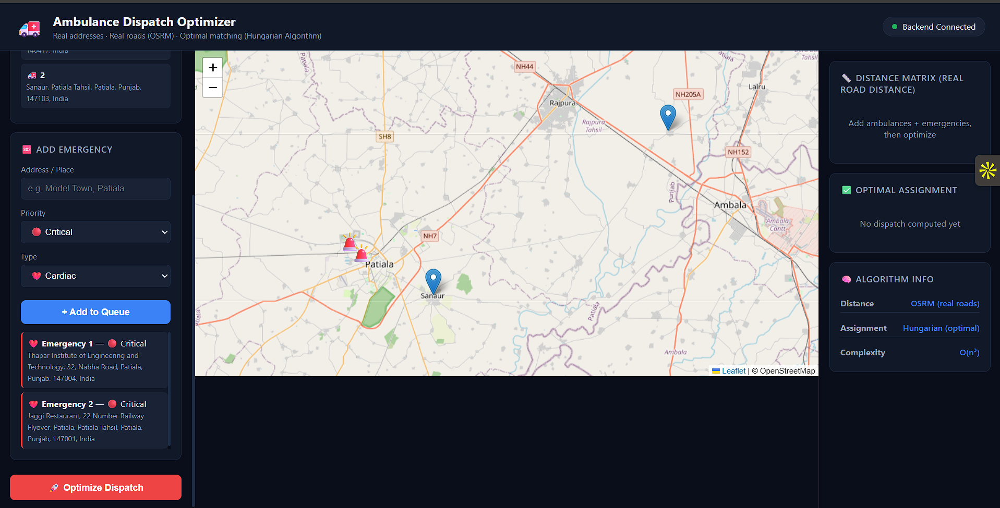
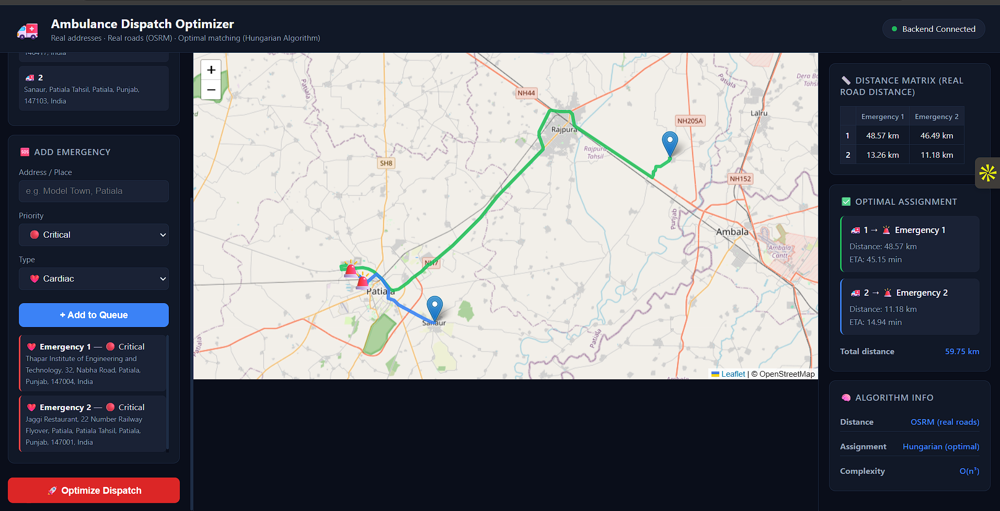
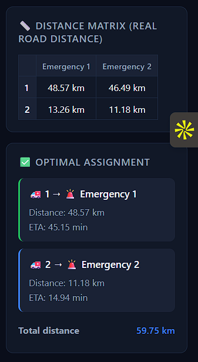
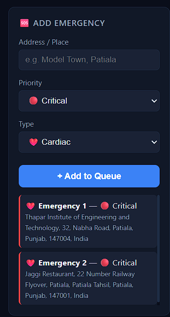
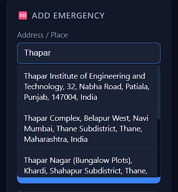
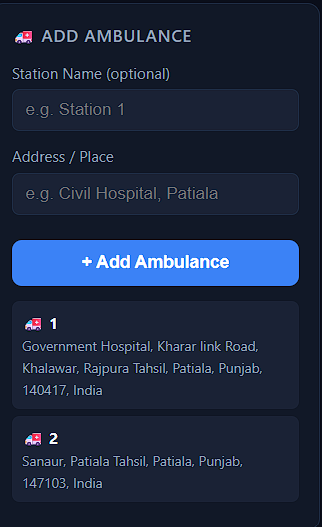
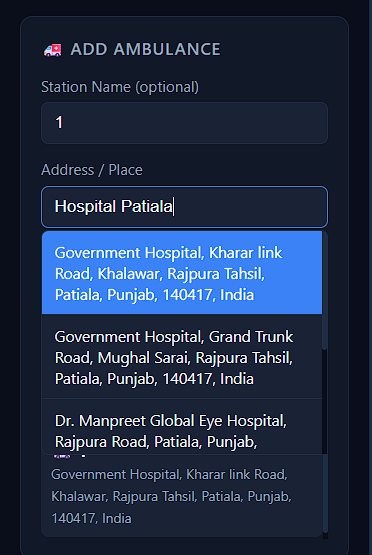

# 🚑 Ambulance Dispatch Optimizer

A real-time ambulance dispatch system that assigns ambulances to emergencies **optimally** using real road distances and the Hungarian Algorithm — not just "nearest ambulance" greedy logic.

**🔗 Live Demo:** [ambulance-dispatch-optimizer-1.onrender.com](https://ambulance-dispatch-optimizer-1.onrender.com/)

---

## 📖 Overview

Emergency response systems often assign the *nearest* ambulance to each emergency independently, which can lead to a globally suboptimal outcome (e.g. two ambulances competing for the same nearby emergency while another sits far and unattended).

This project solves that as an **assignment problem**: given a fleet of ambulances and a queue of emergencies, it computes real road distances between every ambulance–emergency pair and finds the assignment that **minimizes total distance across all dispatches** — using the **Hungarian Algorithm (O(n³))**.

---

## ✨ Features

- 📍 **Real addresses, not dummy coordinates** — search and geocode any real-world location (powered by OpenStreetMap Nominatim)
- 🛣️ **Real road distances & routes** via OSRM (Open Source Routing Machine) — not straight-line distance
- 🧮 **Optimal assignment** using the Hungarian Algorithm, guaranteeing minimum total dispatch distance
- 🗺️ **Interactive live map** built with Leaflet.js showing ambulances, emergencies, and computed routes
- 🚨 **Emergency queue management** — add emergencies with priority (Critical / High / Normal) and type (Cardiac, Accident, Fire, Injury, etc.)
- 🚑 **Ambulance fleet management** — register ambulance stations at any real address
- ⏱️ **ETA calculation** for every dispatch
- 📊 **Distance matrix view** showing computed real-road distance between every ambulance and every emergency
- 🔌 **Full-stack real-time architecture** — C++ dispatch engine + Flask API backend + JS frontend, connected live

---

## 🖼️ Screenshots

### Dashboard — Before Dispatch

### Dashboard — After Optimized Dispatch

### Distance Matrix & Optimal Assignment

### Adding an Emergency (with address autocomplete)
| Add Emergency | Address Autocomplete |
|---|---|
|  |  |

### Adding an Ambulance (with address autocomplete)
| Add Ambulance | Address Autocomplete |
|---|---|
|  |  |

---

## 🧠 How It Works

    1. Add Ambulances     → Register ambulance stations by real address (geocoded via Nominatim)
    2. Add Emergencies    → Register emergencies by real address + priority + type
    3. Optimize Dispatch  →
           a) Backend queries OSRM for real road distance/duration
              between every ambulance x every emergency (distance matrix)
           b) Hungarian Algorithm runs on this matrix to find the
              assignment that minimizes TOTAL distance across all pairs
           c) Routes are drawn on the map, ETA computed for each pair
    4. View Results       → Optimal assignment, per-dispatch distance/ETA,
                             and total fleet distance are displayed

**Why Hungarian Algorithm over Greedy?**
A greedy "nearest ambulance first" approach optimizes each emergency locally, but can produce a worse global outcome (e.g. one ambulance serving two nearby emergencies while a distant one is dispatched from a further station). The Hungarian Algorithm solves the assignment holistically in O(n³), guaranteeing the minimum possible total distance across the whole fleet.

---

## 🏗️ Tech Stack

| Layer | Technology |
|---|---|
| Dispatch Engine | C++ (Hungarian Algorithm for optimal assignment) |
| Backend API | Python (Flask), CORS-enabled |
| Routing / Distance | OSRM (Open Source Routing Machine) — real road network |
| Geocoding | OpenStreetMap Nominatim (address → coordinates + autocomplete) |
| Frontend | HTML, CSS, JavaScript |
| Map Rendering | Leaflet.js |
| Deployment | Render |

---

## 📁 Project Structure

    Ambulance-Dispatch-Optimizer/
    ├── algorithms/       # C++ dispatch engine (Hungarian Algorithm)
    ├── backend/          # Flask API (routing, geocoding, dispatch endpoints)
    ├── frontend/         # UI (map, emergency/ambulance panels, results)
    ├── data/             # Ambulance & emergency data
    ├── screenshots/      # README images
    ├── START_SYSTEM.bat
    └── README.md

---

## 🚀 Usage

1. **Add Ambulances** — enter a station name (optional) and real address, click **+ Add Ambulance**
2. **Add Emergencies** — enter address, select priority and type, click **+ Add to Queue**
3. Click **🚀 Optimize Dispatch**
4. View:
   - Real-road distance matrix between every ambulance–emergency pair
   - Optimal ambulance → emergency assignment with distance & ETA
   - Total fleet distance for the optimal solution
   - Routes drawn live on the map

---

## 🔮 Future Improvements

- [ ] Real-time emergency queue with live updates / websockets
- [ ] Database persistence (currently in-memory)
- [ ] Multi-user / multi-city support
- [ ] Live ambulance GPS tracking
- [ ] Traffic-aware routing (currently static OSRM distances)
- [ ] SMS/push notifications to dispatched ambulance crews
- [ ] Mobile app version

---

## 👤 Author

**Shivam Sukhija**
GitHub: [@sukhijashivam](https://github.com/sukhijashivam)

---

## 📄 License

This project is licensed under the MIT License.
